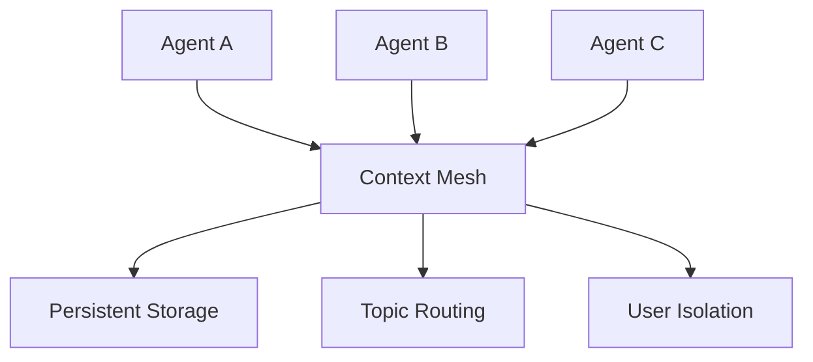

# Core Concepts Overview

Syntha is built around several key concepts that work together to enable seamless multi-agent coordination. Understanding these concepts will help you build more effective AI systems.

## The Big Picture

At its core, Syntha solves the **context sharing problem** in multi-agent systems. Instead of manually passing data between agents, Syntha creates an intelligent layer where agents can automatically share and discover relevant information.



## Core Components

### 1. Context Mesh
The central shared knowledge space where all context lives. Think of it as a smart database that agents can read from and write to.

**Key Features:**
- Automatic context sharing based on permissions
- Topic-based routing for relevant information
- Persistent storage across sessions
- Complete user isolation

### 2. Tool Handler
The interface that agents use to interact with the Context Mesh. It provides LLM-compatible tools for context operations.

**Key Features:**
- Framework-agnostic tool generation
- Role-based access control
- Automatic agent identification
- Error handling and validation

### 3. Framework Adapters
Connectors that make Syntha work seamlessly with your existing LLM framework.

**Supported Frameworks:**
- OpenAI (Function Calling)
- Anthropic Claude (Tool Use)
- LangChain (BaseTool)
- Agno (Native Integration)
- Generic (JSON Schema)

### 4. Prompts
Context-aware prompt builders that automatically include relevant information in your agent prompts.

**Features:**
- Automatic context injection
- Template-based customization
- Topic filtering
- Agent-specific context

### 5. Persistence
Database backends that store context permanently, ensuring continuity across sessions.

**Options:**
- SQLite (Development, small teams)
- PostgreSQL (Production, high concurrency)

### 6. User Isolation
Complete separation of context between different users, ensuring privacy and security.

**Benefits:**
- Zero data leakage between users
- Scalable multi-tenant architecture
- Compliance-ready isolation

## How They Work Together

```python
from syntha import ContextMesh, ToolHandler, build_system_prompt

# 1. Context Mesh stores shared knowledge
context = ContextMesh(user_id="user123")  # User Isolation

# 2. Agents push context through Tool Handler
handler = ToolHandler(context, "SalesAgent")  # Framework Adapters
handler.handle_tool_call("push_context", key="lead_data", value=data)

# 3. Context is stored persistently
# (Automatic via Persistence layer)

# 4. Other agents get context-aware prompts
prompt = build_system_prompt("SupportAgent", context)  # Prompts

# 5. Agents access relevant context through tools
support_handler = ToolHandler(context, "SupportAgent")
tools = support_handler.get_schemas()  # Framework integration
```

## Key Principles

### 1. Automatic Context Sharing
Agents don't need to know about each other. They just push context to topics or specific subscribers, and the system handles routing.

### 2. Framework Agnostic
Syntha works with any LLM framework. You get native tools and prompts for your chosen platform.

### 3. User Isolation by Default
Every user gets their own completely isolated context space. No configuration required.

### 4. Persistent by Design
Context automatically survives between sessions. Your agents build knowledge over time.

### 5. Production Ready
Built with proper error handling, logging, and testing. Ready for real applications.

## Common Patterns

### Topic-Based Routing
Agents subscribe to topics and automatically receive relevant context.

```python
# Agents subscribe to topics they care about
context.register_agent_topics("SalesAgent", ["sales", "customers"])
context.register_agent_topics("SupportAgent", ["support", "customers"])

# Push context to topics
context.push("customer_issue", issue_data, topics=["support", "customers"])
# Both SalesAgent and SupportAgent will see this
```

### Direct Agent Communication
Send context directly to specific agents.

```python
# Send context to specific agents
context.push("private_note", note_data, subscribers=["ManagerAgent"])
# Only ManagerAgent will see this
```

### Global Context
Share information with all agents.

```python
# Global context (no topics or subscribers)
context.push("company_policy", policy_data)
# All agents can access this
```

## Next Steps

Dive deeper into each concept:

- **[Context Mesh](context-mesh.md)** - Learn about the core context sharing system
- **[Tools & Tool Handler](tools.md)** - Understand how agents interact with context
- **[Framework Adapters](adapters.md)** - See how to integrate with your LLM framework
- **[Prompts](prompts.md)** - Build context-aware prompts
- **[Persistence](persistence.md)** - Configure database storage
- **[User Isolation](user-isolation.md)** - Understand multi-user architecture